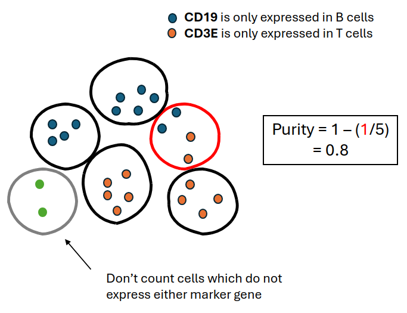
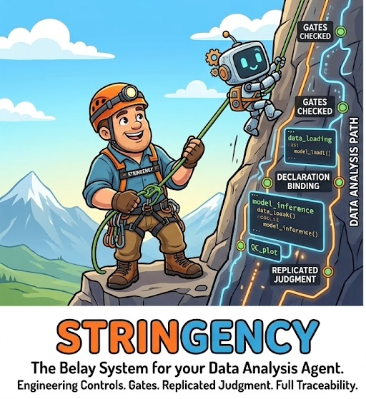
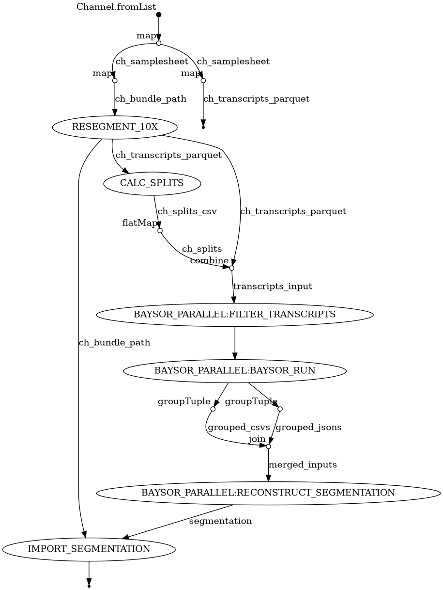

Open-source tools I've built for spatial transcriptomics, single-cell analysis, and AI-driven bioinformatics — on [my GitHub](https://github.com/jrose835) and the [Santangelo Lab's](https://github.com/santangelo-lab).

::: {.entry}
[CRISP](https://github.com/santangelo-lab/CRISP){.entry-title}

R & Python · segmentation quality assessment

{.entry-figure fig-alt="Schematic of the CRISP method: mutually exclusive marker co-expression flags segmentation errors"}
Assesses cell segmentation quality in spatial transcriptomics data by identifying cells that co-express mutually exclusive marker genes. Produces negative-coexpression segmentation purity metrics and supports Xenium, Seurat, and SpatialExperiment objects. Described in [our preprint](https://www.biorxiv.org/content/10.64898/2026.04.16.718947v1).
:::

::: {.entry}
[Stringency](https://github.com/santangelo-lab/stringency){.entry-title}

Python · guardrails for AI-driven analysis

{.entry-figure fig-alt="Stringency diagram: a belayer holding the rope for an AI agent running an analysis"}
Guardrails for AI agents that analyze biological data. Stringency checks that an analysis plan is statistically sound before any code runs, keeps a tamper-proof log of every step the agent takes, and pauses at key decisions until a person signs off — so you can trust, reproduce, and audit what the agent did.
:::

::: {.entry}
[Xenium analysis toolkit]{.entry-title}

Nextflow · R · Python · three pipelines covering raw Xenium output to annotated cells

{.entry-figure .entry-figure-tall fig-alt="Directed acyclic graph of the Xenium segmentation Nextflow pipeline"}

::: {.sub-entry}
[Xen_Segmentation_NextFlow](https://github.com/jrose835/Xen_Segmentation_NextFlow) — Nextflow pipeline for generating alternative cell segmentations (nuclear expansion, Baysor, and others) for 10x Xenium in situ data.
:::

::: {.sub-entry}
[Xen_TMA_pipeline](https://github.com/jrose835/Xen_TMA_pipeline) — splits multi-punch tissue microarrays into per-sample datasets for downstream analysis.
:::

::: {.sub-entry}
[Xen_Seurat_Pipeline](https://github.com/jrose835/Xen_Seurat_Pipeline) — Seurat-based processing: QC, normalization, integration, clustering, and annotation in a reproducible workflow.
:::
:::

::: {.entry}
[pyMFI](https://github.com/jrose835/pyMFI){.entry-title}

Python

Calculates per-cell mean fluorescence intensity (MFI) from imaging data.
:::
